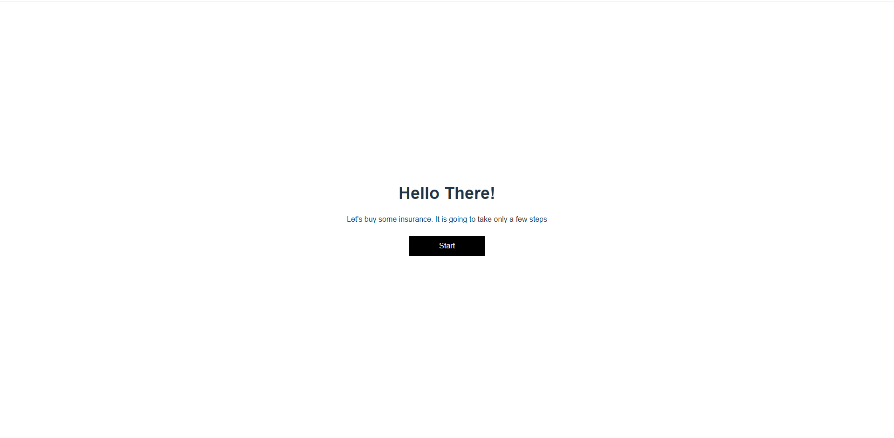

# Form Wizard

## Live site

## Contact info
- **Email:** atsuokoizumi@gmail.com
- **Telegram:** [@mrnew0509](https://t.me/mrnew0509)
- **Skype:** [@live:.cid.56d09b79ed121060](https://join.skype.com/invite/w5h1J26KVD41)
- **Phone:** +81 50 5532 5989

## Release date
July 16, 2022

## Environment
- `Node.js v14.17.0`

## Stack
- **Framework:** `Vue v3.2.37`
- **Theme:** `Tailwind CSS v3.1.6`

## How to run the project.
1. Please open terminal window in the root directory.
2. Please run command `npm run dev` in it.

3. You can see the site like the following image if it is run correctly.

## Architecture

### `main.ts` file
A main file to run the project.

### `App.vue` file
The most parent component.

### `pages` directory
Each file in this directory contains the teamplate and functionality of each page.

### `router` directory
Routes are defined in `index.ts` file.

### `store` directory
There are the modules of store in this directory. Currently, only one module - `formStore` is used.
Each file contains a module.

### `utils` directory
There are utility interfaces, constants and data in this directory.